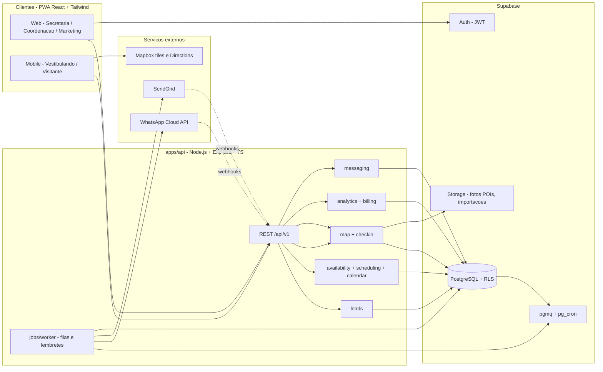

# Arquitetura do CampusFlow

Documento de referência que conecta os requisitos (RF/RNF), a stack definida na apresentação do projeto e a estrutura do repositório. Os planos de execução por camada estão em:

- [`plano-banco-de-dados.md`](plano-banco-de-dados.md)
- [`plano-backend.md`](plano-backend.md)
- [`plano-frontend.md`](plano-frontend.md)

---

## 1. Visão geral

O CampusFlow é um SaaS B2B multi-tenant para instituições de ensino superior que:

1. **Higieniza e centraliza leads** de vestibulandos (importação, deduplicação, exportação Excel, dashboards).
2. **Agenda visitas ao campus sem double-booking**, cruzando a agenda de coordenadores/professores com a escolha do candidato e exigindo confirmação do professor.
3. **Automatiza a comunicação** (WhatsApp Cloud API e SendGrid) com confirmações, lembretes e pesquisas.
4. **Orienta o visitante no campus** com mapa interativo (POIs, rotas) e check-in via QR Code.



---

## 2. Stack (exatamente a descrita na apresentação)

| Camada | Tecnologia | Papel no sistema |
| --- | --- | --- |
| Frontend / PWA | **React + Tailwind CSS** (Vite, TypeScript, vite-plugin-pwa) | Interface responsiva Web (secretarias) e Mobile (visitantes) com suporte offline para o mapa. |
| Backend / APIs | **Node.js / Express** (TypeScript) | Módulo de agendamento anti-conflito e gestão de filas de mensageria. |
| Banco e segurança | **Supabase** (PostgreSQL, Auth, Storage, Queues, Cron) | Banco relacional ACID, multi-tenant via RLS, LGPD. |
| Mensageria | **WhatsApp Cloud API**, **SendGrid** | Disparos multicanal (confirmações, lembretes, campanhas). |
| Mapa | **Mapbox / Leaflet** | Tiles e rotas (Mapbox) renderizados pelo Leaflet no PWA. |

Bibliotecas de apoio (não substituem a stack, apenas a complementam): TanStack Query, React Router, React Hook Form, zod, Recharts, react-leaflet, exceljs, pino, helmet, Vitest.

---

## 3. Decisões arquiteturais

| # | Decisão | Motivação |
| --- | --- | --- |
| D1 | **Monorepo com npm workspaces** (`apps/api`, `apps/web`, `packages/shared`, `supabase/`) | Um único repositório para a equipe; tipos e schemas zod compartilhados evitam divergência entre API e UI. |
| D2 | **TypeScript em todo o código** | "Node.js moderno" (RNF-02) e segurança de tipos no motor de agendamento. |
| D3 | **Monólito modular no Express** com pastas por domínio, mais um **worker separado** | A apresentação fala em "microsserviços de agendamento e filas"; o monólito modular entrega os mesmos limites de contexto com menor custo operacional, e o worker já é um processo independente escalável. Se necessário, cada módulo pode ser extraído. |
| D4 | **Filas com Supabase Queues (pgmq) + pg_cron** em vez de Redis/BullMQ | Mantém a stack exata (Supabase) sem novo componente de infraestrutura; garante entrega única por visibility timeout; lembretes são agendados no próprio banco. |
| D5 | **Anti double-booking no banco** (`EXCLUDE USING gist` + `book_visit()` com `FOR UPDATE`) | Garantia ACID mesmo com múltiplas instâncias da API; a aplicação apenas traduz erros em 409. |
| D6 | **Supabase Auth + RLS por `tenant_id`** | Isolamento multi-tenant (RNF-04) garantido no banco; a API valida o JWT e usa o cliente do usuário para que a RLS seja aplicada. Service role restrito ao worker e a operações internas. |
| D7 | **Evento padronizado criado por trigger** (`Visita Individual - [Nome]`) | RF-04 fica garantido independentemente do caminho de criação da visita. |
| D8 | **PWA com Workbox**: tiles Mapbox e payload do mapa em cache | Requisito de "suporte offline para navegação de mapas dentro do campus". |
| D9 | **Excel gerado no backend** (`exceljs` em stream) | Evita carregar milhares de leads no browser e permite auditoria da exportação (LGPD). |
| D10 | **Coordenadas simples + GeoJSON em jsonb** (sem PostGIS inicialmente) | Escopo de poucos POIs por campus; payload público simples de cachear. PostGIS pode ser habilitado depois. |

---

## 4. Mapeamento requisitos -> módulos

| Requisito | Banco (`supabase/`) | Backend (`apps/api/src`) | Frontend (`apps/web/src`) |
| --- | --- | --- | --- |
| RF-01 Dashboards e exportação Excel | `leads`, `vw_funnel`, `mv_leads_daily`, `audit_logs` | `modules/leads` (export), `modules/analytics` | `features/leads`, `features/dashboard`, `components/charts` |
| RF-02 Calendário do candidato | `visit_slots` | `modules/scheduling` (`/public/scheduling/slots`) | `features/scheduling` (`SlotCalendar`) |
| RF-03 Motor anti double-booking | `visits` (`EXCLUDE`), `book_visit()` | `modules/availability`, `modules/scheduling` (`slot-generator`, RPC) | `features/scheduling` (tratamento 409), `features/calendar` (`AvailabilityEditor`) |
| RF-04 Evento padronizado + confirmação | `calendar_events` + trigger | `modules/calendar` | `features/calendar` (`PendingVisitsList`) |
| RF-05 Comunicações automáticas e lembretes | `message_templates`, `communication_rules`, `message_jobs`, `message_logs`, `pgmq`, `pg_cron` | `modules/messaging`, `integrations/whatsapp`, `integrations/sendgrid`, `jobs/worker` | `features/messaging` |
| RNF-01 PWA React responsivo | - | - | `vite.config.ts` (manifest, Workbox), `pwa/`, layouts responsivos |
| RNF-02 API Node.js | - | toda a `apps/api` | - |
| RNF-03 Supabase relacional | migrações, RLS | `config/supabase.ts` | `lib/supabase.ts` (Auth) |
| RNF-04 SaaS multi-tenant e cobrança | `tenants`, `tenant_id` em tudo, RLS, `plans`, `usage_metrics` | `middlewares/tenant`, `modules/billing`, `enforcePlanLimits` | `features/settings` (`BillingSettings`) |
| Pilar Mapa (apresentação) | `pois`, `routes`, `itineraries`, `checkins` | `modules/map`, `modules/checkin`, `integrations/mapbox` | `features/map`, `features/checkin` |

---

## 5. Fluxos principais

### 5.1 Agendamento e confirmação (RF-02, RF-03, RF-04, RF-05)

```mermaid
sequenceDiagram
  participant C as Candidato (PWA)
  participant API as Express API
  participant DB as Supabase (Postgres)
  participant P as Coordenador (PWA)
  participant W as Worker
  participant WA as WhatsApp / SendGrid

  C->>API: POST /public/leads (dados + consentimento LGPD)
  API->>DB: insert leads (higienizado)
  C->>API: GET /public/scheduling/slots
  API->>DB: select visit_slots disponiveis
  C->>API: POST /public/scheduling/visits (slotId)
  API->>DB: rpc book_visit() [FOR UPDATE + EXCLUDE]
  DB-->>API: visit pending_confirmation
  DB->>DB: trigger cria calendar_event "Visita Individual - Nome"
  API-->>C: 201 aguardando confirmacao
  P->>API: POST /calendar/events/:id/confirm
  API->>DB: update confirmed_at
  DB->>DB: visit -> confirmed; schedule_visit_communications()
  DB->>DB: message_jobs (agora, vespera, 1h antes)
  DB->>DB: pg_cron promove jobs vencidos -> pgmq
  W->>DB: pgmq.read(messages_outbound)
  W->>WA: envia template
  WA-->>API: webhook status (delivered/read)
  API->>DB: update message_logs
```

### 5.2 Visita no campus (Fase 3)

1. Candidato abre `/visita/:token` (QR) e `/mapa/:campusSlug`; service worker cacheia tiles e POIs.
2. Na portaria, embaixador escaneia o QR -> `POST /checkin/scan` -> visita `checked_in`, roteiro do curso exibido.
3. Ao fim (`ends_at`), gatilho `visit.completed` envia pesquisa de satisfação.
4. Visitas confirmadas sem check-in viram `no_show` por `pg_cron`.

---

## 6. Segurança e LGPD

- Autenticação por JWT do Supabase Auth; API valida token e aplica RLS com o cliente do usuário.
- Isolamento por `tenant_id` em todas as tabelas + verificação redundante na API.
- Consentimento explícito do lead (`consent_at`, `consent_source`); função de anonimização e política de retenção.
- Logs sem PII (`pino` redact); auditoria de exportações e alterações sensíveis (`audit_logs`).
- Segredos apenas no servidor (`.env`); frontend recebe somente `VITE_*` públicas (anon key, token Mapbox restrito por domínio).
- Webhooks com verificação de assinatura (SendGrid) e verify token (WhatsApp); rate limit nas rotas públicas.

---

## 7. Ambientes e implantação

| Ambiente | Frontend | API + Worker | Banco |
| --- | --- | --- | --- |
| Local | `vite` em `:5173` (proxy `/api`) | `tsx watch` em `:3333` + `dev:worker` | `supabase start` (`:54321/:54322/:54323`) |
| Staging | Vercel/Netlify (preview por PR) | Container em Render/Railway/Fly.io | Projeto Supabase staging (`supabase db push`) |
| Produção | Vercel/Netlify | Containers separados API e Worker (escala horizontal) | Projeto Supabase `sa-east-1` com PITR |

CI (GitHub Actions): lint -> typecheck -> test -> build em todos os workspaces; job opcional sobe Supabase local para testes de integração.

---

## 8. Roadmap consolidado

| Fase | Escopo | Banco | Backend | Frontend |
| --- | --- | --- | --- | --- |
| 1 - Core Engine | Leads + agendamento anti-conflito + evento padronizado | Etapas 0-3 | Etapas 0-2 | Etapas 0-2 |
| 2 - Mensageria | WhatsApp + SendGrid + régua + templates | Etapa 4 | Etapa 3 | Etapa 3 |
| 3 - Mapa Interativo | POIs, rotas, offline, QR check-in | Etapa 5 | Etapa 4 | Etapa 4 |
| 4 - Analytics e ERP | Dashboards executivos, billing, conectores | Etapa 6 | Etapa 5 | Etapa 5 |
| Transversal | RLS/LGPD, testes, CI/CD, docs | Etapas 7-8 | Etapa 6 | Etapa 6 |
