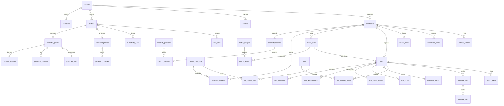

# Plano de Ação - Banco de Dados (Supabase / PostgreSQL) - Revisão 2

Tecnologia mantida: **Supabase** (PostgreSQL 15, Auth, Storage, Queues/pgmq, Cron/pg_cron).

Fonte dos requisitos: **Documento de Requisitos do Sistema - Plataforma Inteligente para Agendamento e Gestão de Visitas Individuais** (`Requisitos_Sistema_Agendamento_Visitas`), seções 3.1 a 3.14, 6 (status) e 7 (regras de negócio). O documento anterior (`Requisitos_Projeto_CampusFlow`, RF-01..05 / RNF-01..04) deixa de guiar o escopo funcional; dele permanecem apenas as escolhas de stack (React/PWA, Node, Supabase) e o isolamento por `tenant_id`.

Objetivos desta revisão: suportar **cadastro + chatbot + perfil comportamental do candidato**, **perfis de promotor e professor**, **motor de match com justificativa**, **convocação/aprovação com prazo e reencaminhamento automático**, **roteiro personalizado**, **status padronizados com histórico**, **notificações por e-mail**, **dashboard operacional** e **integração com o Rubeus**, sem descartar o que já está aplicado no projeto remoto.

Diretório: [`supabase/`](../supabase/). Migrações numeradas em `supabase/migrations/`.

---

## Etapa R0 - Inventário do legado e estratégia de migração

As migrações `0001`–`0009` e o `seed.sql` **já foram aplicados** no projeto Supabase remoto (validados com `npm run db:check`). Não serão reescritas nem revertidas: toda a adequação acontece por **migrações incrementais a partir de `0010`**, mantendo o histórico linear e o `supabase db push` funcional.

Decisões fixadas:

- Tenant único (Mauá) no seed, mas **mantém-se `tenant_id` e RLS** em todas as tabelas (custo zero e evita retrabalho).
- **Renomear em vez de recriar**: `leads` -> `candidates`, `coordinator_id` -> `promoter_id`, `coordinator_courses` -> `promoter_courses`. O Postgres preserva FKs, índices, constraints `EXCLUDE` e políticas ao renomear.
- Enums que perdem valores (`user_role`, `visit_status`) são substituídos por tipo novo + `alter column ... type ... using (mapa)`; enums que só ganham valores (`communication_trigger`) usam `alter type ... add value`.
- Tabelas que saem do núcleo **não são apagadas**: ficam marcadas como legado (comentário `comment on table ... is 'LEGADO: ...'`) e sem novas políticas de escrita.
- Canal de notificação do núcleo: **e-mail**. `message_channel` mantém `whatsapp` para a evolução futura (§8 do documento).

### Tabela "legado implementado -> destino"

| Objeto atual (0001–0009) | Destino |
| --- | --- |
| `tenants`, `campuses`, `courses`, `profiles` | **Manter**. `profiles.role` migra para o novo `user_role`. |
| `coordinator_courses` | **Renomear** para `promoter_courses` (+ coluna `familiarity`). Professores ganham `professor_courses` própria. |
| `leads` | **Renomear** para `candidates` e estender (CPF, disponibilidade, perfil, resumo, `tracking_code`). |
| `lead_imports`, `lead_tags`, `lead_tag_assignments`, `lead_status`, `lead_hygiene_status`, `lead_import_status` | **Legado congelado** (importação em massa/higienização saiu do escopo). Sem drop. |
| `availability_rules`, `availability_exceptions`, `visit_slots` | **Manter**; `coordinator_id` -> `owner_id` (promotor ou professor). Exceções ganham `kind = 'last_minute'`. |
| `visits` | **Evoluir**: `coordinator_id` -> `promoter_id`, novo `professor_id`, `match_run_id`, `focus`, novo `visit_status`, segunda `EXCLUDE` para professor. |
| `calendar_events` | **Manter** como leitura consolidada por visita (título, horário, promotor, professor, status). Confirmação passa a ser derivada de `visit_invitations`. |
| `book_visit`, `cancel_visit`, `confirm_calendar_event`, `decline_calendar_event` | **Substituir** por `schedule_visit_with_match`, `cancel_visit` (nova assinatura), `reschedule_visit`, `respond_invitation`. |
| `generate_visit_slots`, `available_slots` | **Manter** (base de disponibilidade do match). |
| `message_templates`, `communication_rules`, `message_jobs`, `message_logs`, filas `pgmq` | **Manter**; gatilhos e regras realinhados aos novos status; canal padrão `email`. |
| `campaigns`, `campaign_status` | **Legado congelado** (disparo em massa fora do escopo). |
| `pois`, `poi_photos`, `routes`, `route_points`, `itineraries` | **Manter**; POIs ganham tags de interesse e vínculo com promotores aptos; `itineraries` passa a ser roteiro base por curso e surge `visit_itinerary_items` (roteiro personalizado por visita). |
| `checkins`, `check_in_visit`, `checkin_token`, bucket `poi-photos` | **Legado congelado**. Comparecimento vira transição de status (`em_atendimento`/`realizada`/`ausente`) feita pelo promotor ou admin. |
| `plans`, `tenant_subscriptions`, `usage_metrics`, `subscription_status`, `consolidate_usage_metrics` | **Legado congelado** (billing SaaS fora do núcleo). Cron `consolidate-usage-metrics` desagendado. |
| `audit_logs` | **Manter e estender** (decisões automáticas do match, intervenções manuais do admin). |
| `mark_no_shows`, `anonymize_lead`, `apply_lead_retention` | **Adaptar**: `mark_absent_visits`, `anonymize_candidate`, `apply_candidate_retention`. |
| `vw_funnel`, `vw_visits_summary`, `vw_messaging_metrics`, `mv_leads_daily` | **Recriar** sobre o novo modelo (ver Etapa R7). |
| `0009_rls.sql` | **Complementar** com políticas para `promotor` e `professor` e para as tabelas novas. |

Entregável: `0010_pivot_rename.sql` aplicado no remoto com `db:check` verde e `database.types.ts` regenerado.

---

## Etapa R1 - Enums e papéis (`0010_pivot_rename.sql`)

```sql
-- Papéis: admin, promotor, professor (candidato não tem conta Supabase Auth; acessa por token)
create type public.user_role_v2 as enum ('admin', 'promotor', 'professor');
alter table public.profiles
  alter column role type public.user_role_v2
  using (case role::text
           when 'admin' then 'admin' when 'secretaria' then 'admin' when 'marketing' then 'admin'
           when 'coordenador' then 'professor' when 'embaixador' then 'promotor' end)::public.user_role_v2;
drop type public.user_role; alter type public.user_role_v2 rename to user_role;

-- Status da visita (§6 do documento)
-- Antes da troca de tipo: remover a EXCLUDE antiga (o predicado cita valores do enum antigo)
-- e os crons/funções que referenciam status antigos (mark_no_shows, on_visit_status_change);
-- ambos são recriados nas Etapas R5 e R7.
alter table public.visits drop constraint visits_no_overlap;
select cron.unschedule('mark-no-shows');
create type public.visit_status_v2 as enum (
  'agendada', 'aguardando_promotor', 'aguardando_professor', 'confirmada',
  'em_atendimento', 'realizada', 'ausente', 'cancelada', 'reagendada');
alter table public.visits alter column status drop default;
alter table public.visits
  alter column status type public.visit_status_v2
  using (case status::text
           when 'pending_confirmation' then 'aguardando_promotor' when 'confirmed' then 'confirmada'
           when 'checked_in' then 'realizada' when 'no_show' then 'ausente' when 'cancelled' then 'cancelada' end)::public.visit_status_v2;
alter table public.visits alter column status set default 'agendada';
drop type public.visit_status; alter type public.visit_status_v2 rename to visit_status;

-- Novos tipos
create type public.visit_focus as enum ('tecnico', 'academico', 'profissional', 'institucional');
create type public.participant_role as enum ('promotor', 'professor');
create type public.invitation_status as enum ('pending', 'accepted', 'declined', 'expired', 'cancelled');
create type public.match_criterion_kind as enum ('mandatory', 'complementary', 'tiebreaker');
create type public.professor_requirement as enum ('required', 'recommended', 'not_needed');
create type public.question_kind as enum ('single_choice', 'multi_choice', 'scale', 'free_text');
create type public.conversion_event_type as enum ('visit_registered', 'visit_completed', 'lead_updated', 'enrolled', 'lost');

-- Gatilhos de comunicação: só adiciona valores (não remove os antigos)
alter type public.communication_trigger add value 'visit.scheduled';
alter type public.communication_trigger add value 'promoter.invited';
alter type public.communication_trigger add value 'promoter.reassigned';
alter type public.communication_trigger add value 'professor.requested';
alter type public.communication_trigger add value 'visit.rescheduled';
alter type public.communication_trigger add value 'admin.no_substitute';
alter type public.communication_trigger add value 'admin.visit_unattended';
alter type public.availability_exception_kind add value 'last_minute';
```

Funções `current_user_role()` / `has_role()` continuam válidas. `handle_new_auth_user()` passa a exigir `role in ('admin','promotor','professor')` e a criar automaticamente a linha em `promoter_profiles` ou `professor_profiles` (Etapa R3).

Renomeações na mesma migração:

```sql
alter table public.leads rename to candidates;
alter table public.coordinator_courses rename to promoter_courses;
alter table public.promoter_courses rename column coordinator_id to promoter_id;
alter table public.availability_rules rename column coordinator_id to owner_id;
alter table public.availability_exceptions rename column coordinator_id to owner_id;
alter table public.visit_slots rename column coordinator_id to owner_id;
alter table public.visits rename column lead_id to candidate_id;
alter table public.visits rename column coordinator_id to promoter_id;
alter table public.calendar_events rename column coordinator_id to promoter_id;
alter table public.message_jobs rename column lead_id to candidate_id;
alter table public.message_logs rename column lead_id to candidate_id;
```

---

## Etapa R2 - Candidato, chatbot e interesses (`0011_candidates_chatbot.sql`) - §3.1, §3.2

### `candidates` (ex-`leads`) - colunas adicionadas

| Coluna | Tipo | Observação |
| --- | --- | --- |
| `cpf` | `text` | Obrigatório no cadastro público; `check` de 11 dígitos; `unique (tenant_id, cpf)` parcial (`anonymized_at is null`). |
| `tracking_code` | `text unique default encode(gen_random_bytes(6),'hex')` | Identificador único candidato-visita-matrícula enviado ao Rubeus (§3.11). |
| `portal_token` | `uuid unique default gen_random_uuid()` | Acesso do candidato sem conta (atualizar dados, reagendar, cancelar). Rotacionado a cada e-mail de confirmação. |
| `availability_windows` | `jsonb` | Lista `[{weekday, start, end}]` ou `[{date, start, end}]` informada no chatbot. |
| `preferred_focus` | `visit_focus` | Foco preferido (técnico/acadêmico/profissional/institucional). |
| `behavioral_profile` | `jsonb` | Características estruturadas `{trait: score}` derivadas das respostas. |
| `profile_summary` | `text` | Resumo textual gerado para uso interno (promotor/admin). |
| `profile_completed_at` | `timestamptz` | Marca que o chatbot foi concluído e o perfil está pronto para o match. |

`status lead_status` passa a ter apenas uso informativo (`novo`, `agendado`, `visitou`, `matriculado`, `perdido`); `hygiene_status`, `duplicate_of`, `import_id` ficam sem uso e documentados como legado. `email` e `phone` continuam obrigatórios (ao menos um) e validados.

### Chatbot configurável (§3.2, §3.14)

| Tabela | Colunas principais |
| --- | --- |
| `interest_categories` | `id`, `tenant_id`, `slug` (tecnologia, carros, empreendedorismo, pesquisa, laboratorios, esportes, ...), `name`, `description`, `is_active`; `unique (tenant_id, slug)` |
| `chatbot_questions` | `id`, `tenant_id`, `course_id` (null = pergunta geral; preenchido = pergunta específica do curso), `key`, `prompt`, `kind question_kind`, `options jsonb` (`[{value, label, interests: [slug], traits: {trait: delta}, focus}]`), `order_index`, `is_required`, `is_active`, `created_by` |
| `chatbot_sessions` | `id`, `tenant_id`, `candidate_id`, `status` (`in_progress`, `review`, `completed`, `abandoned`), `started_at`, `completed_at`, `channel` (`web`) |
| `chatbot_answers` | `id`, `session_id`, `question_id`, `value jsonb`, `answered_at`; `unique (session_id, question_id)` (revisão sobrescreve) |
| `candidate_interests` | `candidate_id`, `category_id`, `score numeric(4,3)` (0–1), `source` (`chatbot`, `manual`); PK composta |

Função `build_candidate_profile(p_session_id)` (plpgsql, `security definer`): agrega as respostas via `options`, grava `candidate_interests`, `behavioral_profile`, `preferred_focus`, `profile_summary` (texto montado a partir dos top-3 interesses + foco + curso) e `profile_completed_at`. Chamada ao concluir a sessão. Sessão concluída dispara `pg_notify('candidate_profile_ready', candidate_id)`.

Índices: `candidates (tenant_id, cpf)`, `candidates (tenant_id, profile_completed_at)`, `chatbot_answers (session_id)`, trigram em `full_name` mantido.

---

## Etapa R3 - Promotores e professores (`0012_promoters_professors.sql`) - §3.3, §3.7

| Tabela | Colunas principais |
| --- | --- |
| `promoter_profiles` | `profile_id` (PK, FK `profiles`), `bio`, `traits jsonb` (`{comunicacao, perfil_tecnico, conhecimento_cursos, experiencia_atendimento}` 0–1), `preferred_focus visit_focus[]`, `experience_level int` (1–5), `max_visits_per_day int default 3`, `accepts_auto_match bool default true`, `rating_avg numeric(3,2)` (reservado para a avaliação do atendimento, evolução futura §8; até lá permanece nulo e o critério `rating` do match fica inativo), `visits_completed int default 0`, `no_show_count int default 0`, `updated_at` |
| `promoter_courses` (ex-`coordinator_courses`) | `promoter_id`, `course_id`, `familiarity int` (1–5) |
| `promoter_interests` | `promoter_id`, `category_id`, `level int` (1–5) |
| `promoter_pois` | `promoter_id`, `poi_id` - laboratórios/espaços que o promotor está apto a apresentar |
| `professor_profiles` | `profile_id` (PK), `area`, `topics text[]` (temas/dúvidas que atende), `accepts_visits bool`, `is_substitute bool default false`, `updated_at` |
| `professor_courses` | `professor_id`, `course_id`, `is_primary bool` |
| `professor_requirement_rules` | `id`, `tenant_id`, `course_id` (null = qualquer), `focus visit_focus` (null = qualquer), `interest_category_id` (null = qualquer), `requirement professor_requirement`, `priority int`, `is_active` - decide quando a visita **exige** ou **recomenda** professor |
| `promoter_questionnaire` | reutiliza `chatbot_questions` com `audience = 'promotor'` (coluna `audience` adicionada: `candidato`, `promotor`) e `chatbot_sessions.profile_id` nullable; resposta alimenta `promoter_profiles.traits` via `build_promoter_profile(p_session_id)` |

Disponibilidade: `availability_rules`/`availability_exceptions`/`visit_slots` passam a servir promotores **e** professores via `owner_id`; `visit_slots` ganha `owner_role participant_role`. `generate_visit_slots()` recebe `p_owner_id`. Indisponibilidade de última hora = `availability_exceptions (kind = 'last_minute')` cuja inserção dispara `handle_last_minute_unavailability()` (Etapa R5).

Histórico por promotor: view `vw_promoter_history (promoter_id, visit_id, status, starts_at, candidate_name, course)`; indicador de desempenho em `vw_promoter_performance` (Etapa R7).

---

## Etapa R4 - Motor de match (`0013_match.sql`) - §3.4, §7

| Tabela | Colunas principais |
| --- | --- |
| `match_weights` | `id`, `tenant_id`, `criterion` (`course_affinity`, `interest_overlap`, `behavioral_similarity`, `focus_alignment`, `service_experience`, `workload_balance`, `rating`), `weight numeric(5,2)`, `kind match_criterion_kind`, `min_score numeric(4,3)` (para `mandatory`), `is_active`; `unique (tenant_id, criterion)` |
| `match_runs` | `id`, `tenant_id`, `candidate_id`, `visit_id` (null até agendar), `requested_window tstzrange`, `course_id`, `trigger` (`initial`, `reassignment`, `manual`), `requested_by` (null = sistema), `min_compatibility numeric(4,3)`, `status` (`completed`, `no_candidates`), `created_at` |
| `match_results` | `id`, `run_id`, `promoter_id`, `score numeric(5,4)` (0–1, exibido como %), `rank int`, `breakdown jsonb` (`{criterion: {raw, weight, weighted}}`), `justification text` (frase legível para o admin), `is_eligible bool`, `ineligibility_reason text`, `is_selected bool`, `reserve_position int`; `unique (run_id, promoter_id)` |

Função `run_promoter_match(p_candidate_id uuid, p_window tstzrange, p_trigger text, p_exclude_promoters uuid[] default '{}') returns match_runs`:

1. Elegíveis = promotores ativos com `accepts_auto_match`, com curso compatível (`promoter_courses`) e **disponíveis** no `p_window` (existe `visit_slots` aberto do `owner_id` cobrindo a janela e nenhuma `visits` ativa sobreposta) - critérios obrigatórios (§7).
2. Para cada elegível calcula os critérios de `match_weights`; `score = sum(weighted) / sum(weights ativos)`. Reprova quem ficar abaixo de `min_score` de qualquer critério `mandatory`.
3. Desempate por `tiebreaker` (carga do dia, experiência, rating).
4. Grava `match_runs` + `match_results` com `justification` (ex.: "92% - curso compatível, 3 interesses em comum (carros, laboratórios, tecnologia), foco técnico alinhado"); marca `rank = 1` como `is_selected` e demais como fila reserva (`reserve_position`).
5. Se não houver elegível: `status = 'no_candidates'` e insere `admin_alerts` (Etapa R6).

Toda execução grava `audit_logs (action = 'match.run', entity = 'match_runs')` para auditoria das decisões automáticas (§3.14).

---

## Etapa R5 - Visitas, convocações e reencaminhamento (`0014_visits_invitations.sql`) - §3.5, §3.6, §3.9, §3.12

### `visits` - alterações

| Coluna | Observação |
| --- | --- |
| `promoter_id` (ex-`coordinator_id`) | Passa a ser **nullable** (visita pode ficar `aguardando_promotor`). |
| `professor_id uuid` | Nullable; preenchido quando regra exige/recomenda professor. |
| `professor_requirement professor_requirement` | Resultado de `professor_requirement_rules` no agendamento. |
| `match_run_id uuid` | Run que selecionou o promotor atual. |
| `focus visit_focus` | Copiado de `candidates.preferred_focus`. |
| `rescheduled_from_id uuid` | Visita anterior (status `reagendada`) quando há reagendamento. |
| `promoter_briefing jsonb` | Cache do resumo entregue ao promotor (perfil, interesses, POIs sugeridos, professor). |
| `outcome text`, `completed_at`, `absent_marked_at` | Registro do pós-visita. |

Constraints anti dupla alocação (§7, promotor **e** professor):

```sql
-- visits_no_overlap já foi removida em 0010; aqui entram as duas novas
alter table public.visits add constraint visits_promoter_no_overlap
  exclude using gist (promoter_id with =, period with &&)
  where (promoter_id is not null and status in ('agendada','aguardando_professor','confirmada','em_atendimento'));
alter table public.visits add constraint visits_professor_no_overlap
  exclude using gist (professor_id with =, period with &&)
  where (professor_id is not null and status in ('agendada','aguardando_professor','confirmada','em_atendimento'));
```

### Novas tabelas

| Tabela | Colunas principais |
| --- | --- |
| `visit_invitations` | `id`, `tenant_id`, `visit_id`, `profile_id`, `role participant_role`, `status invitation_status`, `match_result_id`, `rank int`, `sent_at`, `expires_at`, `responded_at`, `decline_reason`; índice `(status, expires_at)` para o cron |
| `visit_reassignments` | `id`, `tenant_id`, `visit_id`, `role`, `from_profile_id`, `to_profile_id` (null = sem substituto), `reason` (`declined`, `expired`, `last_minute`, `admin`), `match_run_id`, `triggered_by` (null = sistema), `notified_candidate bool`, `created_at` |
| `visit_status_history` | `id`, `visit_id`, `from_status`, `to_status`, `changed_by` (null = sistema), `reason`, `created_at` - preenchida por trigger `after update of status on visits` |
| `visit_notes` | `id`, `visit_id`, `author_id`, `phase` (`before`, `during`, `after`), `body`, `created_at` |
| `scheduling_policies` | `tenant_id`, `focus visit_focus` (null = padrão), `min_hours_to_cancel int`, `min_hours_to_reschedule int`, `invitation_timeout_minutes int default 120`, `max_reassignments int default 3`, `default_duration_minutes int` - regras de antecedência e política por tipo de visita |

### Funções (todas `security definer`, chamadas pela API com service role ou pelo usuário autenticado quando indicado)

| Função | Comportamento |
| --- | --- |
| `schedule_visit_with_match(p_candidate_id, p_window, p_requested_by)` | Exige `profile_completed_at`; roda `run_promoter_match`; cria `visits` (`status = 'aguardando_promotor'`, `period` do slot escolhido); avalia `professor_requirement_rules`; cria `visit_invitations` para o promotor `rank 1` (`expires_at = now() + invitation_timeout`) e, se `required/recommended`, para o professor mais compatível (área/curso/disponibilidade); cria `calendar_events`; enfileira `visit.scheduled` (candidato) e `promoter.invited`. |
| `respond_invitation(p_invitation_id, p_accept bool, p_reason)` | Chamada pelo próprio convidado (`auth.uid()`) ou admin. Aceite do promotor -> `visits.status` = `aguardando_professor` (se houver convite pendente de professor) ou `confirmada`. Recusa/expiração -> `reassign_visit`. Aceite do professor com promotor confirmado -> `confirmada`. Recusa do professor -> tenta professor substituto (`is_substitute`) e, sem opção, `professor_id = null` + alerta admin se `required`. |
| `reassign_visit(p_visit_id, p_role, p_reason, p_actor)` | Próximo da fila (`match_results.reserve_position`) ainda disponível; se a fila acabou, novo `run_promoter_match` excluindo anteriores; registra `visit_reassignments`; respeita `max_reassignments`; sem substituto -> `admin_alerts` + gatilho `admin.no_substitute`. Notifica candidato só se `promoter_briefing` mudar de forma relevante (professor removido ou horário alterado). |
| `handle_last_minute_unavailability()` | Trigger em `availability_exceptions (kind = 'last_minute')`: para cada visita ativa do `owner_id` no período, chama `reassign_visit(..., 'last_minute')` e enfileira alerta imediato. |
| `cancel_visit(p_visit_id, p_actor, p_reason)` | Valida `min_hours_to_cancel` (admin ignora); status `cancelada`; cancela `visit_invitations` pendentes e `message_jobs` futuros; libera slot; enfileira `visit.cancelled` para todos os envolvidos. |
| `reschedule_visit(p_visit_id, p_new_window, p_actor)` | Valida `min_hours_to_reschedule`; marca a atual como `reagendada` (`rescheduled_from_id` na nova); chama `schedule_visit_with_match` tentando manter o mesmo promotor se disponível (§3.6 "sem refazer todo o processo"). |
| `set_visit_status(p_visit_id, p_status, p_actor, p_reason)` | Transições manuais permitidas: `confirmada -> em_atendimento -> realizada`, `confirmada -> ausente`, admin pode qualquer. Mantém `candidates.status` sincronizado (`agendado`/`visitou`). |
| `assign_visit_manually(p_visit_id, p_role, p_profile_id, p_actor)` | Match manual do admin (§3.14); grava `visit_reassignments (reason = 'admin')` e `audit_logs`. |

Trigger `on_visit_status_change()` (já existe) é reescrito para os novos status e gatilhos: `confirmada` -> agenda lembretes (`reminder.day_before`, `reminder.hour_before`) e gera o roteiro (Etapa R6); `cancelada`/`reagendada` -> cancela jobs; `realizada`/`ausente` -> `conversion_events (visit_completed)` e `visit.completed`.

Deduplicação de notificações (§3.13): `message_jobs` ganha `dedupe_key text` + índice único parcial `(visit_id, dedupe_key) where status = 'scheduled'`; alterações sucessivas substituem o job pendente em vez de somar.

---

## Etapa R6 - Roteiro, alertas e notificações (`0015_itinerary_alerts.sql`) - §3.8, §3.13, §3.14

### Roteiro personalizado

| Tabela | Colunas principais |
| --- | --- |
| `poi_interest_tags` | `poi_id`, `category_id` (FK `interest_categories`), `relevance int` (1–5) - liga espaços do campus aos interesses |
| `visit_itinerary_items` | `id`, `visit_id`, `poi_id`, `order_index`, `reason text` ("candidato interessado em carros"), `source` (`suggested`, `manual`), `added_by`, `dwell_minutes` |

Função `generate_visit_itinerary(p_visit_id)`: parte do roteiro base do curso (`itineraries` -> `route_points`), soma POIs com `poi_interest_tags` que intersectam `candidate_interests` (ordenados por `score * relevance`) e restringe a POIs que o promotor está apto a apresentar (`promoter_pois`, quando cadastrado). Monta `visits.promoter_briefing` = `{candidate: {name, course, focus, summary, top_interests}, professor: {...}, pois: [...]}`. Reexecutada quando o promotor muda ou quando novos POIs com tags relevantes são cadastrados (trigger em `poi_interest_tags` para visitas futuras `confirmada`).

### Central de pendências e alertas (§3.14)

| Objeto | Descrição |
| --- | --- |
| `admin_alerts` | `id`, `tenant_id`, `kind` (`no_substitute`, `visit_unattended`, `professor_required_missing`, `invitation_expiring`, `schedule_conflict`), `visit_id`, `severity` (`info`, `warning`, `critical`), `message`, `resolved_at`, `resolved_by`, `created_at` |
| `vw_pending_issues` | União de: visitas `aguardando_promotor`/`aguardando_professor` com `starts_at < now() + 48h`; convites `pending` com `expires_at < now() + 30 min`; visitas com `professor_requirement = 'required'` e `professor_id is null`; `admin_alerts` não resolvidos. |

Notificações: `communication_rules` recebe seeds para os novos gatilhos com `channel = 'email'` e `audience` (`candidato`, `promotor`, `professor`, `admin`) - coluna nova. `schedule_visit_communications()` passa a resolver destinatário por `audience`. `notification_preferences (profile_id, trigger, channel, enabled)` permite configurar tipos de notificação por perfil.

---

## Etapa R7 - Rubeus, dashboard e retenção (`0016_rubeus_analytics.sql`) - §3.10, §3.11

### Integração Rubeus

| Tabela | Colunas principais |
| --- | --- |
| `rubeus_links` | `candidate_id` (PK), `tenant_id`, `tracking_code` (cópia), `rubeus_contact_id text`, `rubeus_opportunity_id text`, `last_pushed_at`, `last_pull_at`, `last_status text`, `last_error text` |
| `rubeus_outbox` | `id`, `tenant_id`, `candidate_id`, `visit_id`, `event conversion_event_type`, `payload jsonb`, `status` (`pending`, `sent`, `failed`), `attempts int`, `next_attempt_at`, `created_at` - fila de envio (worker Node consome; fila `pgmq` `rubeus_outbound` criada aqui) |
| `conversion_events` | `id`, `tenant_id`, `candidate_id`, `visit_id`, `type conversion_event_type`, `source` (`system`, `rubeus`, `manual`), `occurred_at`, `raw jsonb` |

Triggers: `candidates` criado / `visits` `realizada` ou `ausente` -> `rubeus_outbox`. Evento `enrolled` recebido do Rubeus -> `candidates.status = 'matriculado'`, `enrolled_at`.

### Views do dashboard (substituem `vw_funnel`, `vw_visits_summary`, `mv_leads_daily`)

| View | Conteúdo |
| --- | --- |
| `vw_visits_kpis` | Por tenant/campus/curso/promotor/dia: agendadas, confirmadas, realizadas, ausentes, canceladas, reagendadas; taxas de comparecimento, cancelamento e reagendamento. |
| `vw_slot_occupancy` | Taxa de ocupação dos horários (`visits` ativas / `visit_slots` abertos) por semana e por promotor. |
| `vw_reassignment_metrics` | Quantidade de remanejamentos por motivo, por promotor e por período; visitas sem substituto. |
| `vw_promoter_performance` | Visitas realizadas, taxa de comparecimento dos seus candidatos, remanejamentos sofridos, `rating_avg`. |
| `vw_conversion` | Conversão visitante -> aluno por curso, período e faixa de compatibilidade (`match_results.score` do run selecionado) e por foco da visita. |
| `mv_visits_daily` | Materialized view diária (substitui `mv_leads_daily`); refresh horário. |

### Jobs `pg_cron` (revisados)

| Job | Cron | Ação |
| --- | --- | --- |
| `expire-invitations` | `* * * * *` | `expire_pending_invitations()` -> `respond_invitation(..., false, 'expired')` para convites vencidos. |
| `promote-message-jobs` | `* * * * *` | Mantido. |
| `mark-absent-visits` | `*/15 * * * *` | `mark_absent_visits()`: `confirmada` com `upper(period) + 30 min < now()` e sem `em_atendimento`/`realizada` -> `ausente`. |
| `alert-unattended-visits` | `0 * * * *` | Visitas nas próximas 24h ainda `aguardando_promotor`/`aguardando_professor` -> `admin_alerts (critical)` + gatilho `admin.visit_unattended`. |
| `refresh-mv-visits-daily` | `0 * * * *` | Substitui `refresh-mv-leads-daily`. |
| `apply-candidate-retention` | `0 3 * * 0` | `anonymize_candidate()` para candidatos `perdido` sem interação há 24 meses. |
| `consolidate-usage-metrics` | - | **Desagendado** (`cron.unschedule`). |

---

## Etapa R8 - RLS, LGPD e seed (`0017_rls_v2.sql`, `seed.sql`)

1. Habilitar RLS em todas as tabelas novas.
2. Políticas por papel:
   - `admin`: leitura/escrita total no tenant.
   - `promotor`: lê `visits`/`calendar_events`/`visit_itinerary_items`/`visit_notes`/`candidates` (colunas expostas via view `vw_promoter_visit_briefing`, sem CPF) apenas onde `promoter_id = auth.uid()`; escreve `availability_*` próprias, `visit_invitations` próprias (`respond_invitation`), `visit_notes`, `set_visit_status` (`em_atendimento`/`realizada`/`ausente`), `promoter_profiles` própria.
   - `professor`: equivalente, filtrando `professor_id = auth.uid()`; escreve `professor_profiles`, `availability_*`, convites próprios.
   - Candidato: sem conta; rotas públicas da API usam service role e validam `portal_token` (nunca leitura direta do banco).
3. Dados compartilhados com o promotor (§9 "quais informações poderão ser compartilhadas"): a view de briefing expõe nome, curso, foco, interesses e resumo; **não** expõe CPF, telefone nem e-mail.
4. LGPD: `consent_at`/`consent_source` obrigatórios no cadastro público; `anonymize_candidate()` também limpa `chatbot_answers.value` e `profile_summary`; `audit_logs` registra exportações da agenda e intervenções manuais.
5. `seed.sql` atualizado: tenant Mauá, campus, cursos, 1 admin, 4 promotores com perfis/interesses/cursos, 2 professores (1 substituto), `interest_categories` (tecnologia, carros, empreendedorismo, pesquisa, laboratórios, esportes, sustentabilidade, saúde), 12 perguntas do chatbot (8 gerais + exemplos por curso), `match_weights` padrão (curso 30 / interesses 25 / comportamental 20 / foco 10 / experiência 10 / carga 5; obrigatórios: disponibilidade e compatibilidade mínima 0,5), `professor_requirement_rules` de exemplo, `scheduling_policies` (24h cancelar, 12h reagendar, convite 120 min), templates de e-mail e `communication_rules` para os novos gatilhos, POIs com `poi_interest_tags`.
6. Regenerar `packages/shared/src/database.types.ts` e atualizar `packages/shared/src/enums.ts`.

---

## Diagrama ER (principais entidades)



---

## Cronograma revisado

| Semana | Entrega |
| --- | --- |
| 1 | R0–R1: `0010` (enums, papéis, renomeações) aplicada no remoto; tipos regenerados; API compilando com os novos nomes. |
| 2 | R2: candidatos, chatbot configurável, interesses, `build_candidate_profile`. |
| 3 | R3: perfis de promotor e professor, disponibilidade por `owner_id`, regras de necessidade de professor. |
| 4 | R4: `match_weights`, `run_promoter_match`, justificativa, testes de ranking. |
| 5–6 | R5: visitas, convites com prazo, reencaminhamento, políticas de antecedência, histórico de status, `EXCLUDE` promotor + professor; testes de concorrência. |
| 7 | R6: roteiro personalizado, briefing do promotor, alertas e central de pendências, notificações por e-mail deduplicadas. |
| 8 | R7: Rubeus (outbox/links/conversão), views do dashboard, crons revisados. |
| 9 | R8: RLS v2, LGPD, seed completo, documentação e tipos finais. |
