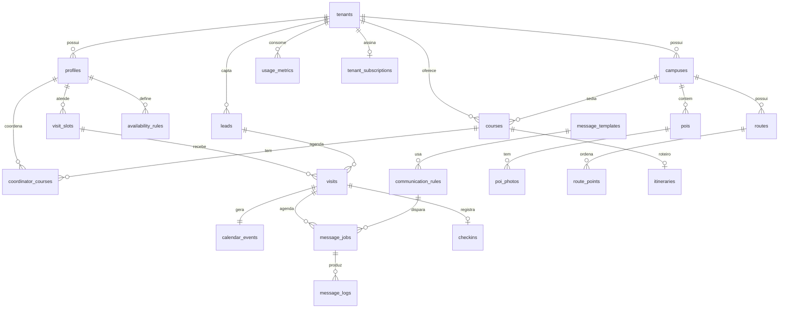

# Plano de Ação - Banco de Dados (Supabase / PostgreSQL)

Tecnologia: **Supabase** (PostgreSQL 15, Auth, Storage, Queues/pgmq, Cron/pg_cron), conforme RNF-03.

Objetivos: integridade e ACID nos cadastros e agendamentos, isolamento multi-tenant (RNF-04), impedimento de double-booking no nível do banco (RF-03), suporte a filas de comunicação (RF-05) e conformidade com a LGPD.

Diretório: [`supabase/`](../supabase/). Migrações numeradas em `supabase/migrations/`.

---

## Etapa 0 - Setup do ambiente

1. Criar projeto no [Supabase](https://supabase.com) (região `sa-east-1`, São Paulo) para produção; usar Supabase CLI local para desenvolvimento.
2. Instalar a CLI: `npm i -g supabase` (ou via Scoop no Windows) e rodar `supabase start` na raiz do repositório (usa `supabase/config.toml`).
3. Guardar em `.env`: `SUPABASE_URL`, `SUPABASE_ANON_KEY`, `SUPABASE_SERVICE_ROLE_KEY`, `SUPABASE_DB_URL`.
4. Habilitar extensões (migração `0001_extensions.sql`, já criada): `pgcrypto`, `btree_gist`, `pg_cron`, `pgmq`, `pg_trgm`; criar a fila `messages_outbound`.
5. Gerar tipos TypeScript após cada migração: `supabase gen types typescript --local > packages/shared/src/database.types.ts`.

Entregável: banco local subindo com `supabase db reset` sem erros.

---

## Etapa 1 - Enums e tenancy (`0002_enums.sql`, `0003_tenancy.sql`)

### Enums (espelham `packages/shared/src/enums.ts`)

```sql
create type user_role as enum ('admin','secretaria','coordenador','marketing','embaixador');
create type lead_status as enum ('novo','contatado','agendado','visitou','matriculado','perdido');
create type lead_hygiene_status as enum ('valid','duplicate','invalid');
create type visit_type as enum ('individual','group');
create type visit_status as enum ('pending_confirmation','confirmed','cancelled','checked_in','no_show');
create type message_channel as enum ('whatsapp','email');
create type message_status as enum ('queued','sent','delivered','read','opened','clicked','failed','bounced');
create type communication_trigger as enum ('visit.created','visit.confirmed','visit.declined','visit.cancelled','reminder.day_before','reminder.hour_before','visit.completed');
create type poi_category as enum ('laboratorio','biblioteca','auditorio','sala_de_aula','alimentacao','secretaria','estacionamento','portaria','outro');
```

### Tabelas

| Tabela | Colunas principais | Observações |
| --- | --- | --- |
| `tenants` | `id`, `name`, `slug` (unique), `timezone` (default `America/Sao_Paulo`), `settings jsonb` (duração padrão de visita, antecedência mínima), `created_at` | Uma instituição de ensino = um tenant. |
| `campuses` | `id`, `tenant_id`, `name`, `slug`, `address`, `latitude`, `longitude`, `map_bounds jsonb` | `unique (tenant_id, slug)`; coordenadas alimentam o mapa. |
| `profiles` | `id` (= `auth.users.id`), `tenant_id`, `full_name`, `email`, `phone`, `role user_role`, `is_active`, `avatar_url` | Criado por trigger `on_auth_user_created` lendo `raw_user_meta_data` (`tenant_id`, `role`). |
| `courses` | `id`, `tenant_id`, `campus_id`, `name`, `is_active` | Curso de interesse do lead e base do roteiro. |
| `coordinator_courses` | `coordinator_id`, `course_id` | N:N; define quem recebe visitas de qual curso. |

### Funções auxiliares

```sql
-- tenant do usuário autenticado (usado nas políticas RLS)
create or replace function public.current_tenant_id() returns uuid
language sql stable security definer as $$
  select tenant_id from public.profiles where id = auth.uid()
$$;

create or replace function public.current_role() returns user_role
language sql stable security definer as $$
  select role from public.profiles where id = auth.uid()
$$;

-- updated_at automático
create or replace function public.set_updated_at() returns trigger ...
```

---

## Etapa 2 - Leads (`0004_leads.sql`) - Fase 1, RF-01

| Tabela | Colunas principais |
| --- | --- |
| `leads` | `id`, `tenant_id`, `campus_id`, `course_id`, `full_name`, `email`, `phone` (E.164), `source` (site, feira, indicação, importação), `status lead_status`, `hygiene_status lead_hygiene_status`, `duplicate_of uuid`, `consent_at`, `consent_source`, `import_id`, `enrolled_at`, `metadata jsonb`, `created_at`, `updated_at` |
| `lead_imports` | `id`, `tenant_id`, `uploaded_by`, `file_path` (Storage `lead-imports`), `total_rows`, `valid_rows`, `duplicate_rows`, `invalid_rows`, `status` (`preview`,`confirmed`,`failed`), `created_at` |
| `lead_tags` | `id`, `tenant_id`, `name`, `color` + tabela `lead_tag_assignments (lead_id, tag_id)` |

Índices e regras:

- `unique (tenant_id, email)` e `unique (tenant_id, phone)` **parciais** (`where hygiene_status = 'valid'`) para permitir registrar duplicados sem quebrar a importação.
- `create index on leads using gin (full_name gin_trgm_ops)` para busca.
- `create index on leads (tenant_id, created_at desc)` para listagens e dashboards.
- Trigger que muda `status` para `agendado` quando uma visita é criada e `visitou` no check-in.

---

## Etapa 3 - Agendamento (`0005_scheduling.sql`) - Fase 1, RF-02/RF-03/RF-04

### Tabelas

| Tabela | Colunas principais |
| --- | --- |
| `availability_rules` | `id`, `tenant_id`, `coordinator_id`, `campus_id`, `weekday` (0-6), `start_time time`, `end_time time`, `slot_duration_minutes`, `capacity`, `valid_from date`, `valid_until date` |
| `availability_exceptions` | `id`, `tenant_id`, `coordinator_id`, `period tstzrange`, `kind` (`block`,`extra`), `reason` |
| `visit_slots` | `id`, `tenant_id`, `campus_id`, `coordinator_id`, `starts_at timestamptz`, `ends_at timestamptz`, `capacity int`, `booked_count int default 0`, `is_open bool`, `generated_from_rule uuid` |
| `visits` | `id`, `tenant_id`, `lead_id`, `slot_id`, `coordinator_id`, `campus_id`, `course_id`, `type visit_type`, `group_size int`, `status visit_status`, `period tstzrange` (gerado a partir do slot), `checkin_token uuid unique default gen_random_uuid()`, `checked_in_at`, `cancel_reason`, `notes`, `created_at`, `updated_at` |
| `calendar_events` | `id`, `tenant_id`, `visit_id` (unique), `coordinator_id`, `title text`, `starts_at`, `ends_at`, `confirmed_at`, `confirmed_by`, `declined_at`, `decline_reason` |

### Garantia anti double-booking (RF-03)

```sql
-- 1) Nenhum coordenador com dois compromissos ativos sobrepostos
alter table visits add constraint visits_no_overlap
  exclude using gist (
    coordinator_id with =,
    period with &&
  ) where (status in ('pending_confirmation','confirmed','checked_in'));

-- 2) Capacidade do slot respeitada de forma atômica
create or replace function public.book_visit(
  p_slot_id uuid, p_lead_id uuid, p_type visit_type default 'individual',
  p_group_size int default 1, p_notes text default null
) returns visits
language plpgsql security definer as $$
declare v_slot visit_slots; v_visit visits; v_lead leads;
begin
  select * into v_slot from visit_slots where id = p_slot_id for update;
  if v_slot is null or not v_slot.is_open then
    raise exception 'SLOT_NOT_FOUND' using errcode = 'P0002';
  end if;
  if v_slot.booked_count + p_group_size > v_slot.capacity then
    raise exception 'SLOT_UNAVAILABLE' using errcode = 'P0001';
  end if;
  select * into v_lead from leads where id = p_lead_id;

  insert into visits (tenant_id, lead_id, slot_id, coordinator_id, campus_id, course_id,
                      type, group_size, status, period, notes)
  values (v_slot.tenant_id, p_lead_id, v_slot.id, v_slot.coordinator_id, v_slot.campus_id,
          v_lead.course_id, p_type, p_group_size, 'pending_confirmation',
          tstzrange(v_slot.starts_at, v_slot.ends_at, '[)'), p_notes)
  returning * into v_visit;

  update visit_slots set booked_count = booked_count + p_group_size where id = v_slot.id;
  return v_visit;
end $$;
```

Observação: para visitas em grupo com o mesmo coordenador no mesmo slot, a constraint `EXCLUDE` deve considerar o slot: usar `(slot_id with =, ...)` apenas quando `capacity = 1`, ou modelar com `exclude (coordinator_id with =, period with &&) where (capacity_exclusive)`. Decisão de implementação: slots com `capacity > 1` são "tours em grupo" e a exclusividade fica por conta do `booked_count`; slots com `capacity = 1` entram na `EXCLUDE`.

### Evento padronizado (RF-04)

```sql
create or replace function public.create_calendar_event() returns trigger
language plpgsql as $$
begin
  insert into calendar_events (tenant_id, visit_id, coordinator_id, title, starts_at, ends_at)
  select new.tenant_id, new.id, new.coordinator_id,
         case when new.type = 'group' then 'Visita em Grupo - ' else 'Visita Individual - ' end
           || l.full_name,
         lower(new.period), upper(new.period)
  from leads l where l.id = new.lead_id;
  return new;
end $$;

create trigger trg_visit_calendar_event after insert on visits
for each row execute function public.create_calendar_event();
```

Confirmação do professor: `update calendar_events set confirmed_at = now(), confirmed_by = auth.uid()` + trigger que muda `visits.status` para `confirmed` e emite `pg_notify('visit_confirmed', visit_id)` / insere em `message_jobs` (Etapa 4).

---

## Etapa 4 - Mensageria (`0006_messaging.sql`) - Fase 2, RF-05

| Tabela | Colunas principais |
| --- | --- |
| `message_templates` | `id`, `tenant_id`, `name`, `channel message_channel`, `subject`, `body`, `provider_template_name` (nome aprovado na Meta), `variables text[]`, `is_active` |
| `communication_rules` | `id`, `tenant_id`, `trigger communication_trigger`, `channel`, `template_id`, `offset_minutes int` (ex.: `-1440` véspera, `-60` uma hora antes), `is_active`; `unique (tenant_id, trigger, channel)` |
| `message_jobs` | `id`, `tenant_id`, `visit_id`, `lead_id`, `rule_id`, `channel`, `run_at timestamptz`, `payload jsonb` (template renderizado), `status` (`scheduled`,`enqueued`,`cancelled`), `enqueued_at` |
| `message_logs` | `id`, `tenant_id`, `job_id`, `lead_id`, `visit_id`, `campaign_id`, `channel`, `to_address`, `status message_status`, `provider_message_id`, `error`, `sent_at`, `delivered_at`, `read_at`, `opened_at`, `clicked_at`, `created_at` |
| `campaigns` | `id`, `tenant_id`, `name`, `channel`, `template_id`, `segment jsonb` (filtros de leads), `scheduled_at`, `created_by`, `status` |

Fluxo no banco:

1. Trigger em `calendar_events` (confirmação) chama `schedule_visit_communications(visit_id)`: para cada regra ativa do tenant, insere `message_jobs` com `run_at = starts_at + offset` (confirmação imediata usa `run_at = now()`).
2. `pg_cron` a cada minuto:
   ```sql
   select cron.schedule('promote-message-jobs', '* * * * *', $$
     with due as (
       update message_jobs set status = 'enqueued', enqueued_at = now()
       where status = 'scheduled' and run_at <= now()
       returning id, tenant_id, channel, payload
     )
     select pgmq.send('messages_outbound', to_jsonb(d)) from due d;
   $$);
   ```
3. Worker Node consome `pgmq.read('messages_outbound', 60, 10)` e grava `message_logs`.
4. Cancelamento da visita marca `message_jobs.status = 'cancelled'` para lembretes futuros.

Expor as funções `pgmq.send/read/archive/delete` via schema `pgmq_public` (já listado em `config.toml`) para o cliente Supabase do worker, ou chamar via RPC wrappers `security definer`.

---

## Etapa 5 - Mapa e check-in (`0007_map.sql`) - Fase 3

| Tabela | Colunas principais |
| --- | --- |
| `pois` | `id`, `tenant_id`, `campus_id`, `name`, `category poi_category`, `description`, `latitude`, `longitude`, `floor`, `building`, `is_accessible`, `order_index`, `is_active` |
| `poi_photos` | `id`, `poi_id`, `storage_path` (bucket `poi-photos`), `caption`, `order_index` |
| `routes` | `id`, `tenant_id`, `campus_id`, `name`, `is_accessible`, `geometry jsonb` (GeoJSON LineString) |
| `route_points` | `id`, `route_id`, `poi_id`, `order_index`, `dwell_minutes` |
| `itineraries` | `id`, `tenant_id`, `course_id` (unique), `route_id`, `description` |
| `checkins` | `id`, `tenant_id`, `visit_id`, `scanned_by`, `scanned_at`, `location jsonb` |

Extensão PostGIS é opcional; para o escopo (poucas centenas de POIs por campus) `latitude`/`longitude` numéricos e GeoJSON em `jsonb` são suficientes e mantêm o payload público simples de cachear offline.

View pública `vw_public_campus_map (campus_id, pois jsonb, routes jsonb)` lida pela rota `/api/v1/public/map/:campusId`.

---

## Etapa 6 - Analytics e billing (`0008_analytics_billing.sql`) - Fase 4, RF-01/RNF-04

| Objeto | Descrição |
| --- | --- |
| `plans` | `id`, `name`, `max_leads_month`, `max_coordinators`, `max_whatsapp_month`, `price_cents`, `addons jsonb` |
| `tenant_subscriptions` | `tenant_id`, `plan_id`, `started_at`, `ends_at`, `status` |
| `usage_metrics` | `tenant_id`, `period date` (mês), `leads_processed`, `active_coordinators`, `whatsapp_sent`, `emails_sent`, `visits_completed`; `unique (tenant_id, period)` |
| `audit_logs` | `id`, `tenant_id`, `actor_id`, `action`, `entity`, `entity_id`, `diff jsonb`, `created_at` |
| `vw_funnel` | leads -> agendados -> confirmados -> check-in -> matriculados por tenant/campus/período |
| `mv_leads_daily` | materialized view com contagem diária por origem/curso; `refresh` via `pg_cron` a cada hora |
| `vw_messaging_metrics` | taxa de entrega/abertura/clique por template e canal |

Jobs `pg_cron`:

- `mark-no-shows` (a cada 15 min): visitas `confirmed` com `upper(period) + interval '30 min' < now()` e sem `checked_in_at` -> `no_show`.
- `refresh-mv-leads-daily` (hora em hora).
- `consolidate-usage-metrics` (dia 1 de cada mês, 02:00) alimenta `usage_metrics` do mês anterior.

---

## Etapa 7 - Segurança, RLS e LGPD (`0009_rls.sql`)

1. `alter table ... enable row level security` em **todas** as tabelas de negócio.
2. Política base de leitura por tenant:
   ```sql
   create policy tenant_read on leads for select
     using (tenant_id = public.current_tenant_id());
   ```
3. Políticas de escrita por papel (exemplos):
   - `leads`: insert/update por `admin`, `secretaria`, `marketing`.
   - `availability_rules`: coordenador altera apenas onde `coordinator_id = auth.uid()`; admin/secretaria alteram qualquer.
   - `calendar_events`: confirmação apenas pelo coordenador do evento ou admin.
   - `message_templates`, `communication_rules`: admin, secretaria, marketing.
   - `pois`, `routes`: admin, secretaria, embaixador.
4. Rotas públicas do candidato (formulário e reserva) passam pela API com service role, mas apenas via `book_visit()` e inserção controlada em `leads`; nenhuma leitura pública direta.
5. LGPD:
   - Campos `consent_at`/`consent_source` obrigatórios para leads oriundos do formulário público.
   - Função `anonymize_lead(lead_id)` substitui nome/e-mail/telefone por hashes e mantém métricas agregadas.
   - Job `pg_cron` de retenção: leads `perdido` sem interação há mais de 24 meses -> anonimizar (configurável por tenant em `tenants.settings`).
   - `audit_logs` registra exportações de dados (RF-01) com `actor_id`.
   - Backups automáticos do Supabase + PITR em produção; criptografia em repouso e em trânsito nativas.

---

## Etapa 8 - Índices, seeds e qualidade

- Índices compostos em `(tenant_id, <coluna de filtro>)` para todas as listagens; `visit_slots (campus_id, starts_at) where is_open`.
- `seed.sql` com tenant Mauá, campus, cursos, perfis, disponibilidade, leads, templates e POIs de exemplo (ver comentários no arquivo).
- Testes de banco com `pgTAP` (opcional) ou testes de integração da API contra o Supabase local cobrindo: double-booking rejeitado, capacidade respeitada, RLS bloqueando acesso cruzado entre tenants.
- Gerar `database.types.ts` após cada migração e versionar.

---

## Diagrama ER (principais entidades)



---

## Cronograma sugerido

| Semana | Entrega |
| --- | --- |
| 1 | Etapas 0-1: ambiente local, enums, tenancy, trigger de `profiles`, RLS básica. |
| 2 | Etapa 2: leads, importação, índices; seed inicial. |
| 3-4 | Etapa 3: agendamento completo com `EXCLUDE`, `book_visit()`, eventos padronizados; testes de concorrência. |
| 5-6 | Etapa 4: mensageria, `pgmq`, `pg_cron`, jobs de lembrete. |
| 7 | Etapa 5: mapa e check-in. |
| 8 | Etapa 6: analytics, billing, jobs mensais. |
| 9 | Etapa 7-8: revisão de RLS, LGPD, anonimização, documentação e tipos gerados. |
